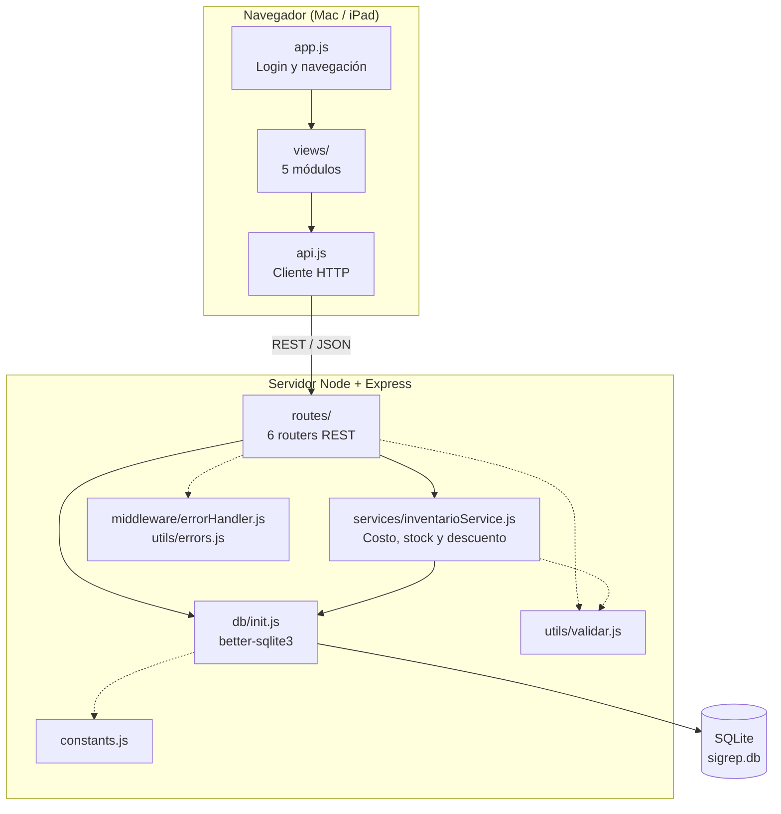
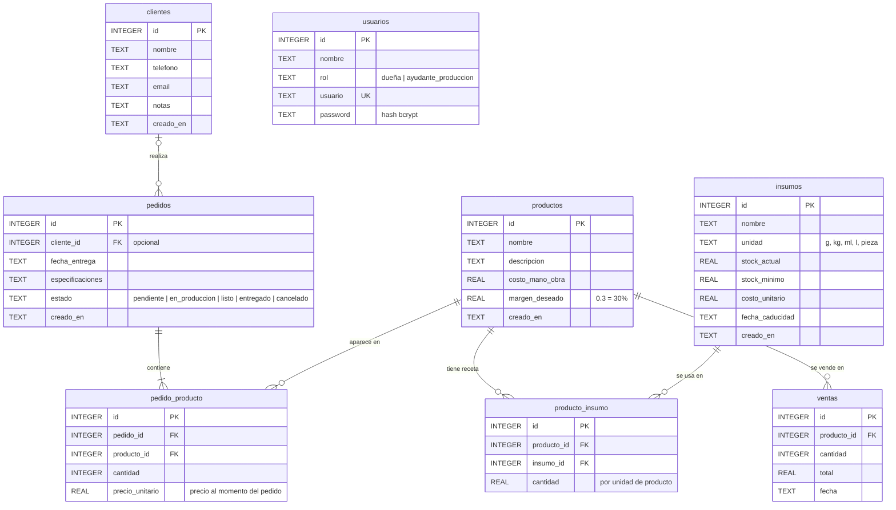

# SIGREP — Diseño del sistema

## 1. Arquitectura

Aplicación web cliente-servidor. 

### Módulos y rutas 

| Módulo | Ruta base | Archivo |
|---|---|---|
| Inventario | `/api/insumos` | `routes/insumos.js` |
| Calculadora de precios y recetas | `/api/productos` | `routes/productos.js` |
| Clientes | `/api/clientes` | `routes/clientes.js` |
| Pedidos | `/api/pedidos` | `routes/pedidos.js` |
| Ventas y reportes | `/api/ventas` | `routes/ventas.js` |
| Usuarios y login | `/api/usuarios` | `routes/usuarios.js` |

## 2. Modelo entidad-relación

