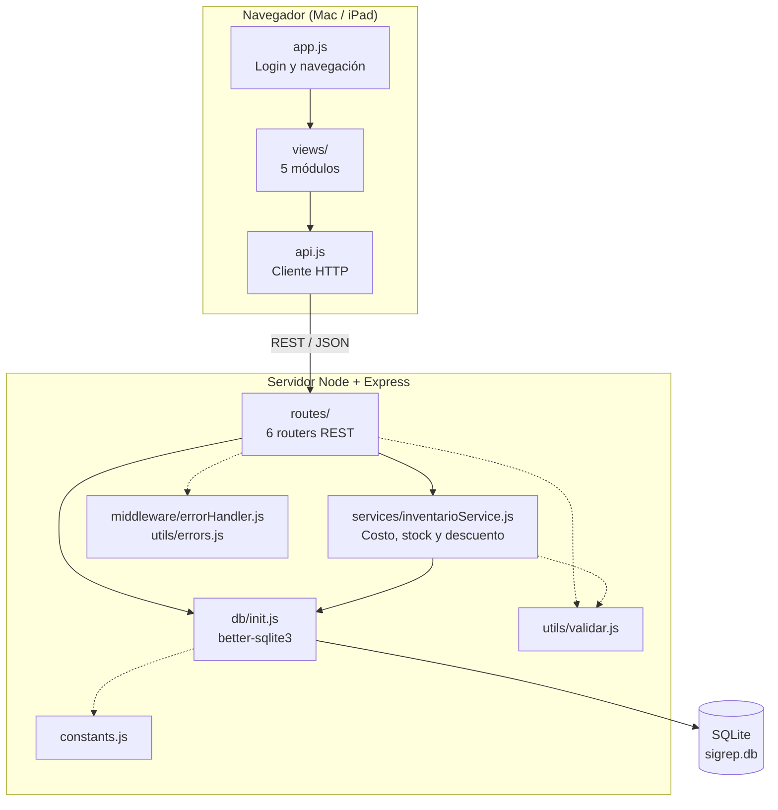

# SIGREP — Diseño del sistema

## 1. Arquitectura

Aplicación web cliente-servidor. El mismo servidor Express expone la API REST y sirve el frontend estático. El backend se organiza en capas: rutas, servicio de negocio y acceso a la base de datos, con módulos transversales de errores, validación y constantes.

Las flechas punteadas son dependencias transversales: validación de entradas, manejo centralizado de errores y constantes de negocio.

### Módulos y rutas de la API

| Módulo | Ruta base | Archivo |
|---|---|---|
| Inventario | `/api/insumos` | `routes/insumos.js` |
| Calculadora de precios y recetas | `/api/productos` | `routes/productos.js` |
| Clientes | `/api/clientes` | `routes/clientes.js` |
| Pedidos | `/api/pedidos` | `routes/pedidos.js` |
| Ventas y reportes | `/api/ventas` | `routes/ventas.js` |
| Usuarios y login | `/api/usuarios` | `routes/usuarios.js` |

## 2. Modelo entidad-relación

### Notas del modelo

- `producto_insumo` es la receta. Resuelve la relación N:N entre productos e insumos y tiene `UNIQUE(producto_id, insumo_id)`.
- `pedido_producto` guarda `precio_unitario` al momento del pedido, para que un cambio posterior de precio no altere pedidos ya registrados.
- `pedidos.cliente_id` es opcional.
- `usuarios` no se relaciona con otras tablas: hoy no se registra quién crea un pedido o una venta.
- `ventas` solo apunta a un producto (venta de mostrador); no se enlaza a clientes ni a pedidos.
- Restricciones: `CHECK` en `usuarios.rol` y `pedidos.estado`, claves foráneas activadas (`foreign_keys = ON`) y `ON DELETE CASCADE` en la receta y en el detalle de pedido.
- Fórmula de precio: `precio_sugerido = (costo_insumos + costo_mano_obra) × (1 + margen_deseado)`.
